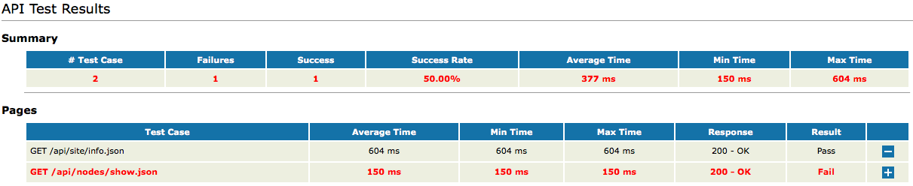

# Jmeter HTML Report by XSL

## 1. Install [Jmeter](http://jmeter.apache.org/) and [xsltproc](http://xmlsoft.org/XSLT/xsltproc2.html) 
## 2. Run your jmeter case
## 3. Usage
    xsltproc /xsl/jmeter-results-report-apitest.xsl JMETER_TC.jtl > JMETER_TC.html  

